# Milestone 3 - Your Recipe Hub - by Kevin Bourke


Your Recipe Hub is a recipe website where users can search for recipes via text search or categories. If they wish they can also submit their own recipes to the site. If they register, users can read, create, update and delete recipes. There many sites in existence that have this kind of functionality already, such as [Kitchen Stories](https://www.kitchenstories.com/en) and [Allrecipes](https://www.allrecipes.com/). Essentially the users would be building a database of recipes for public use.

The live deployed site can be found here - https://your-recipe-hub.herokuapp.com/

## UX

I wanted the site to have 3 main overarching features.
 - [x] Users should be able to browse by category or search the site for recipes.
 - [x] If they like, users should be able to register and login to the site.
 - [x] If logged in, users should be able to upload their own recipes.

### User Stories

This section provides insight into the UX process, focusing on who this website is for, what it is that they want to achieve and how this project is the best way to help them achieve these things. It expands on the main features as were listed above.

#### As a User who is just using the site as a resource for recipe ideas I would like to:

- [x] Browse recipes by food course.
- [x] Browse recipes by food category.
- [x] Search the site by keyword for recipes easily.
- [x] Easily see the time required for each recipe while browsing.
- [x] Easily view latest Recipes.
- [x] Sign up to a newsletter.

#### As a User who would like to contribute recipes to the site I would also like to:

- [x] Register for an account.
- [x] Login to my account.
- [x] Submit my own recipes to be shown on the website.
- [x] Use the site as a repository for my own recipes.
- [x] Easily view recipes I have submitted.
- [x] Edit my own recipes, but other users cannot edit or delete my recipes.
- [x] Delete my own recipes.
- [x] Add new categories.
- [x] Delete categories.
- [x] Log out of my account.
- [x] Get clear messages if something does not work, like a username is already taken.

#### As admin or the site owner I would like to do all the above as well as:

- [ ] Edit or Remove all recipes.
- [ ] Edit or remove all categories.
- [ ] Manage Courses.
- [ ] Remove Users if required.

These admin features are not currently developed, but are certainly something a site admin would want to have

#### As a developer

I include this here to explain what I, as a developer, wanted to get out of this project. 

 - To provide an easy to use, online recipe repository, which provides users with full CRUD functionality.
 - To improve my knowledge of Python, Flask and Jinja templating, with a practical project.
 - To learn about basic user authentication, without using a prebuilt add-on module.
 - To learn about MongoDB indexing for text searches.
 - To learn to use the [Materialize Framework](https://materializecss.com/), to see how it compares to the likes of Bootstrap.
 - Connecting a web app to a database to create and store data, in this case in a non-relational database, MongoDB.
 - To learn to deploy the web app through Heroku.


### Strategy

The goals of this type of website are to:

1. Be a resource for users to get recipe ideas.
2. Allow users to submit and manage their own recipe ideas.
3. Be a repository of recipes for a registered user, i.e easily access their own submitted recipes.
4. To give ratings or feedback on recipes.
5. To give admins full control over all users recipes and categories, and also courses.

### Scope

This section determines what the users should be able to do on the website. Users should be able to:

- [x] Browse recipes by food course.
- [x] Browse recipes by food category.
- [x] Search the site by keyword for recipes easily.
- [x] Easily see the time required for each recipe while browsing.
- [x] Easily view latest Recipes.
- [x] Sign up to a newsletter.
- [x] Register for an account.
- [x] Login to their account.
- [x] Submit their own recipes to be shown on the website.
- [x] Use the site as a repository for their own recipes.
- [x] Easily view recipes they have submitted.
- [x] Edit their own recipes, but other users cannot edit or delete their recipes.
- [x] Delete their own recipes.
- [x] Add new categories.
- [x] Delete categories.
- [x] Log out of their account.

### Structure

To list the pages I needed and to visualise the site structure, I designed my visual sitemap in Gloomap. In the sitemap below, the pages marked in green represent site User (logged in) pages:


I also listed out the features I wanted on the homepage:

#### A Large Search Feature

The whole site is about finding recipes so I wanted to have this ability right up front and not have users having to go looking for how they browse or search. The [Food Network](https://foodnetwork.co.uk/) and [Epicurious](https://www.epicurious.com/) are examples of sites with a big search as the first thing on the page, and a large cover image. I also did not want it too cluttered. A lot of recipe sites have a lot going on and the user needs to think too much about what they want to do.

#### Obvious signposts to recipes by Course

I wanted clear and obvious entry points to recipes by course. It should have quality images, icons or graphics. I did not plan a section like this for the categories as they are editable by the user and could change or be edited or deleted.

#### Recent Recipes

I wanted to show just some of the latest recipes, so users would have something different to see each time they arrived on the site and if they submit a new recipe it would appear here.

### Skeleton

I sketched up some very rough ideas on paper and then designed the final wireframes, which were created in Balsamiq:

- [Home page on desktop wireframe](README_resources/wireframes/homepage-desktop.png)
- [Home page on mobile wireframe](README_resources/wireframes/homepage-mobile.png)
- [All Recipes on desktop wireframe](README_resources/wireframes/all-recipes-desktop.png)
- [All Recipes on mobile wireframe](README_resources/wireframes/all-recipes-mobile.png)
- [Recipe page on desktop wireframe](README_resources/wireframes/recipe-page-desktop.png)
- [Recipe page on mobile wireframe](README_resources/wireframes/recipe-page-mobile.png)
- [Add Recipe on desktop wireframe](README_resources/wireframes/add-recipe-desktop.png)
- [Add Recipe on mobile wireframe](README_resources/wireframes/add-recipe-mobile.png)
- [Recipes Category on desktop wireframe](README_resources/wireframes/category-recipes-desktop.png)
- [Recipes Category on mobile wireframe](README_resources/wireframes/category-recipes-mobile.png)
- [Sign up on desktop wireframe](README_resources/wireframes/sign-up-desktop.png)
- [Sign up on mobile wireframe](README_resources/wireframes/sign-up-mobile.png)

There is also a login page which is very similar to the sign up page except with no email field and different intro text, and also an Edit Recipe page which is basically identical to Add Recipe except the values are pre-populated from the database.

Also note, my wireframes and sitemap did change slightly during development as I learned more about how best to display certain pages, like recipe categories or the search results page. The knowledge I gained throughout the project would allow me a much better understanding of what was possible or what might work best for future projects.

I also thought my original idea for the navigation below the logo, like [EatingWell](http://www.eatingwell.com/), made the header take up far too much vertical space and really just left a large space at the top. So I decided to move the navigation up in line with the logo and 'Add Recipe' button.

### Surface

This is the sensory design section of a website, or how it looks, feels and sounds. I wanted the design to be clean and the colour scheme to be light and refreshing. I created a moodboard with Adobe Spark from research of colours, styles and components to visually illustrate the style I wished to pursue. You can see that [moodboard here.](README_resources/mood-board.png) 

Some of those sites also served as inspiration for the recipe layout and recipe cards.

An obvious colour choice for representing healthy food is green. Green stands for nature and growth according to this [99designs article](https://99designs.ie/blog/tips/color-psychology/), and it is also a literal representation of healthy foods, like vegetables and salads.

I wanted the site to be clean and bright. The [Yummly](https://www.yummly.com/) is a good example of this, it is mostly white with green and orange contrasting colours for buttons and other icons.

I researched colour combinations, particularly looking for green and another contrasting colour. I liked the number 17 "Teal, coral, turquoise and grey" palette on this [article](https://99designs.ie/blog/creative-inspiration/color-combinations/), but wanted to bring the green closer to a leafy green colour and also make the coral colour a bit more vibrant. I used [Coolors](https://coolors.co/) and picked a nice green #25b35f as my base green, and generated different colour palettes. It actually generated one that was quite similar to the palette above, with oranges and greys. I felt the orange was a bit too pastel and light, so I just picked a different shade of that orange. I also lightened the shade of the lighter grey, as I imagined using it as a background colour where there might be text on it, so wanted to make sure dark text would be able to stand out on the grey.

This was my final palette:


You can also see it completely in [PDF format here](README_resources/colour-palette-your-recipe-hub.pdf).

Colours for some buttons, like edit and delete were based on different shades of materialize colours.

#### Fonts

On all the recipe websites I researched, I liked the font used on [Napolina](https://www.napolina.com/recipes/30-minute/rigatoni-with-goats-cheese-and-spinach) as a heading, it really stood out as being slightly different with the narrow 's'. However this font is an Adobe Font called 'Mostra Nuova' and would require a licence (Adobe subscription). So I used Google font's filter options to find a narrow, sans-serif to look for a font with similar properties. The [Yanone Kaffeesatz](https://fonts.google.com/specimen/Yanone+Kaffeesatz) font was a more interesting font than most, as it has some slightly different shaped characters than most other fonts of similar type, the k, r and e being good examples. Google fonts has suggestions for font pairings that would work for each particular font, so I looked through these for a nice body font. I wanted this font to be wider and easier to read at small sizes and had a bit of a contrast with the headings, so I decided [Montserrat](https://fonts.google.com/specimen/Montserrat) would work well.
This [canva article](https://www.canva.com/learn/the-ultimate-guide-to-font-pairing/) also shows Montserrat working well with Narrower heading fonts.

### Database Schema

Based on the functionality required and the data to be stored, I created my database structure. The Recipe and Categories documents (or tables) would have fields of the same name, so a recipe can be saved to a course type and a category. A recipe would also need a user, if users are to log in and have the recipes they create connected to their profile.

For now the users do not need to supply an email, but if this project was to advance, this would most probably be require, for things like forgotten password resets.

The subscribers collection would for now only store an email. This is not actually connected to any newsletter service. In the future, this subscriber email could be connected to the users.


### Defensive Design

An important part of UX is making sure users cannot cause errors, and that they get positive useful feedback if they try to perform an action that they are not allowed to. This includes things like:
 - A user cannot break the site (or cause an error appear on screen), by pressing buttons out of expected order, or using browser forward and back buttons.
 - Required Form inputs give warnings or feedback if not filled, or filled correctly.
 - A user is given feedback if they are not allowed to do something, like register an already existing username.
 - A custom '404 page not found' page.

## Technologies Used

### Languages and Frameworks
1. HTML
2. CSS
3. Javascript 
4. Python
5. [Flask Framework](https://palletsprojects.com/p/flask/)
6. Jinja templating for Python
7. [MongoDB Database](https://www.mongodb.com/)
8. [Heroku hosting platform](https://heroku.com)
9. [Materialize Framework](https://materializecss.com/)
10. [Font Awesome](https://fontawesome.com/)
11. Google Fonts
12. [JQuery](https://jquery.com) - The project uses **JQuery** to simplify DOM manipulation, and animation of certain elements.
13. Extended Material Design icons from [Material Design Icons](https://materialdesignicons.com/)

### Tools Used
1. [VS Code](https://code.visualstudio.com/) and [Brackets](http://brackets.io/) code editors.
2. [Git](https://git-scm.com/) - Installed on local devices and integrated with VS Code and Brackets, to allow version control.
3. [GitHub](https://github.com/) - Used a repository for the project files and previous versions. Also used to deploy the website.
4. [Balsamiq](https://balsamiq.com/) - Used for creating wireframes for different variations and different screen sizes.
5. I used Photoshop and Illustrator for image and svg manipulation.
6. [TinyPNG](https://tinypng.com/) - To keep transparent png sizes to a minimum I used the online png compressing service [TinyPNG](https://tinypng.com/), as well as the desktop application.
7. [Coolor](https://coolors.co/) - Used top help determine the colour scheme.
8. [The Padwan Project](https://github.com/Eventyret/Padawan) - While I did not use this tool to generate my project's starting point as I started with [Code Institute's Full template](https://github.com/Code-Institute-Org/gitpod-full-template), I did use it as a reference.
9. [Gloomaps](https://www.gloomaps.com/) - For creating my sitemap.
10. [Cloudinary](https://cloudinary.com/) for storing recipe images and images for testing with.


## Features
 
### Existing Features

#### The ability to browse/search by recipe categories that are on the website.

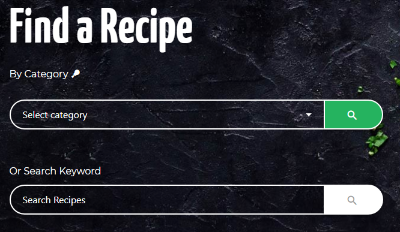

#### The ability to search recipes by text keyword. 

This search only searches the recipes title and short description fields. I decided against including the ingredients field as there may be too many minor ingredients that cause too many recipes to appear in the results. For example, nearly every recipe could conceivably contain pepper, but if someone was searching for say a bell pepper recipe, they would have all recipes returned. Plus usually people are searching for a dish title or the main ingredient around which the dish is based.

If their search yields no results, this will be displayed to them:

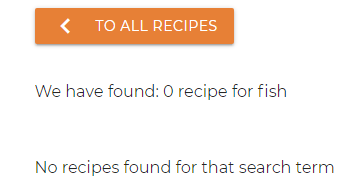

This is the same whether they browse by category or course.

#### The ability to browse by recipe course.

#### The most recent recipes are shown on the homepage.

#### The recipe cards display some useful information

When the recipes are listed in a grid the recipe cards displays some useful information that would be useful to a user trying to decide on a recipe, such as the type of course it is, how long in total to make and portion size:

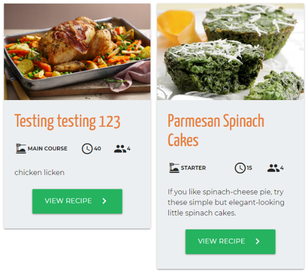

#### A single recipe page is easy to read

A recipe page displays all recipe information and it is easy to find the key points of information:

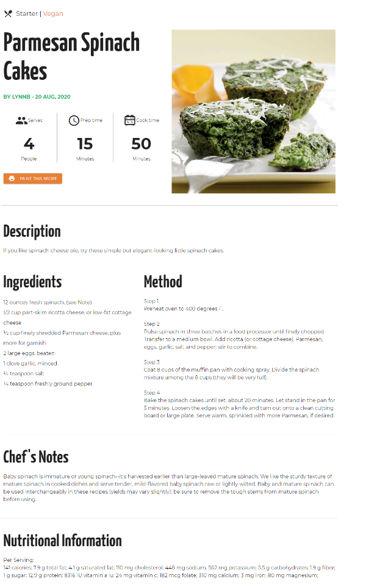

#### On a single recipe page the category links to a list of recipes from that category

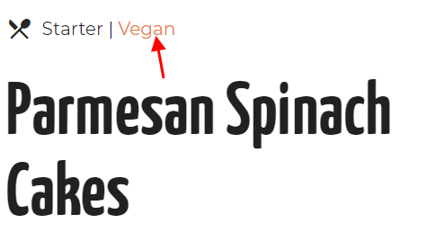

#### The ability to easily print a recipe in a printer friendly format.

On each recipe page there is a print button, which just easily allows the user to print a recipe. There is a print stylesheet that removes elements you would not need/want printed like the navigation, and it only loads on the individual recipe page.

#### Users can register a profile on the site.

The register form asks a user to confirm their password to make sure they typed it correctly. It verifies that they are the same.

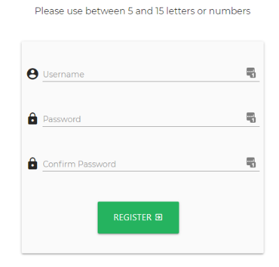

#### Users can login and logout of the site.

#### When logged in users get addition options in the navigation.

As they can do more when logged in users can see these options in the navigation bar.

*When logged out*:

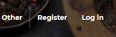

*When logged in*

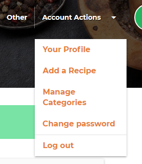

#### Logged in users can add their own recipes to the site.

#### Logged in users can delete only their own recipes.

#### Logged in users can edit only their own recipes.

The edit and delete buttons do not appear if the user has not submitted this recipe.

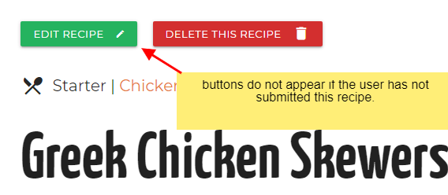

#### Logged in users can view their own submitted recipes via their profile.

By navigating to their profile page a user can view all the recipes that they have submitted to the site.

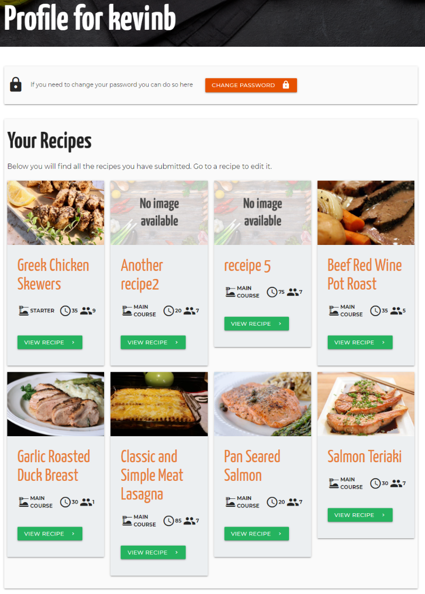

When they first create an account and they have no recipes, they are told they have no recipes and there is a button to encourage them to submit a recipes.

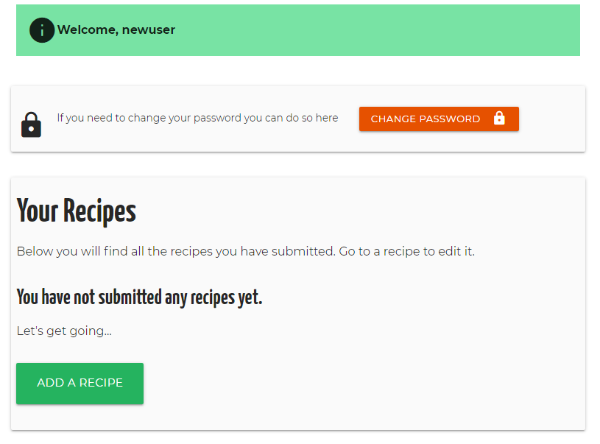

#### Logged in users can change their password.

#### Logged in users can manage categories (but not courses).

Users can add and remove categories if they wish. But they cannot edit the courses, because courses really stay the same, there is no need for a user to be changing them.

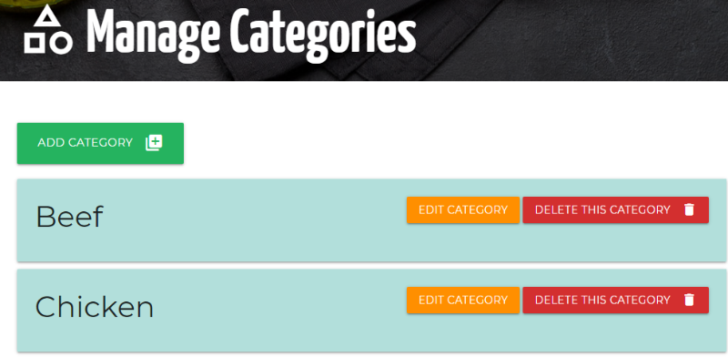

#### Any user can subscribe to the newsletter.

Currently this just saves the user's email in the database, and is not signing them up to any mailing service.

#### Minor Features

##### Back to top (of page) button

Expand the sections below for more info on details:

<details>
  <summary><strong>Responsive images</strong></summary>

As the recipe images are provided by external users I could not make these smaller for mobile.
To allow me to use a different image for the 'no recipe image' for mobile I used the `<picture>` element. This allowed me to create a smaller image just for a mobile.
The large images for the background of the search panel and title panels actually have 5 different size variations depending on the screen width, using CSS media queries.

</details>

<details>
  <summary><strong>Password matching on Register</strong></summary>

There is a 'Confirm Password' field on the register form which compares the 2 password fields, basically by setting the pattern attribute of the 'Confirm password' field to the first using simple JavaScript onchange function. The basics of this are very simple, the onchange function on the first password field sets the pattern attribute on the second field to be the value of the first field.
If they do not match, on submission the browser notifies the user "Please match the format requested", which means the password comparing is working but the notification is not clear in what it is asking for. This is the browser default for a pattern not matching, but ideally it should says something like "Passwords do not match". I thought I was going to have to find some javascript to change this and was looking on [this article](https://www.the-art-of-web.com/javascript/validate-password/#section_5) and found that the simplest thing to do is to use a title attribute, and most browsers will automatically display that text in case of a missing value or pattern mismatch. So I did not include any additional Javascript for this for the moment.
I was also going to include a [RegEx polyfill](https://www.the-art-of-web.com/javascript/validate-password/#section_7) because if your password1 contains a '*' or other special regular expression characters, the pattern for password2 can become invalid. But at the moment my password1 field pattern attribute is actually set to just characters from a-z or numbers so this is not required.

</details>

<details>
  <summary><strong>Skip to main content</strong></summary>

 There is a 'Skip to main content' link just inside the body tag for accessibility for screen readers. The main content is not usually the first thing on a web page. Keyboard and screen reader users generally must navigate a long list of navigation links, sub-lists of links, corporate icons, site searches, and other elements before ever arriving at the main content. This is then hidden from view with the class 'sr-only', however when it receives focus from keyboard it becomes visible. This is based on accessibility recommendations from https://webaim.org/techniques/skipnav/. This can be checked by pressing tab when a pages loads, and then pressing tab again should show the next focused element is on the page content and not the logo or navigation.

 </details>

### Features to consider implementing in the future

 - Pagination on recipe listings.
 - Allow an Admin User to manage all users, manage all recipes, manage courses.
 - When logged in, view some basic statistics like, how many recipes, how many categories, how many recipes in each category, and how many registered users.
 - Have some core categories users cannot edit.
 - Additional Categorisation by Cuisine (Italian, Chinese etc...) and tags, like for specific ingredients like eggs or potatoes.
 - Allow users upload photos rather than just using a url
 - Better fields for ingredients so that each ingredient can be submitted in it's own field rather than a textarea field for all. This would allow for much better styling and presentation on the front-end.
 - Allow users to rate/review recipes, and favourite other peoples recipes.
  

## Testing

For the purposes of testing, you can use the image urls provided in the [Testing Document](TESTING.md), which also has the information on all my testing.

## Deployment

### 1. Clone from github 
To run locally, you can clone this repository directly into the editor of your choice. Open a folder where you want to save the project to and then in the terminal paste `git clone https://github.com/Bourkekev/ms3-your-recipe-hub.git`. To cut ties with this GitHub repository, type `git remote rm origin` into the terminal. The project will be now cloned into your folder.

### 2. Create database on MongoDB
Create an account on [MongoDb](https://www.mongodb.com/), create a cluster and a database (keeping a note of all passwords) and construct the 5 collections as shown in my database [diagram](#Database-Schema).

### 3. Install requirements

In terminal type (you might need 'sudo' before the following on some environments):

```
$ pip3 install -r requirements.txt
```

### 4. Create `env.py` file

Create a file named `env.py` in the root directory of your project. This is the file you will use to define your environment variables. We need the following data in the env file:

```
import os

os.environ.setdefault("SECRET_KEY", "YOUR_SECRET_KEY_HERE")
os.environ.setdefault("MONGO_DBNAME", "YOUR_DATABASE_NAME")
os.environ["MONGO_URI"] = ""
```
Replace YOUR_SECRET_KEY_HERE with a random string.
Replace YOUR_DATABASE_NAME with your database name.

You need to get your mongo uri from mongodb. In MongoDB, go to your cluster and click 'connect' button. Select 'Connect your application' from the options. Then select the version of Python you are using, and click the copy button in step 2 to copy the connection string:

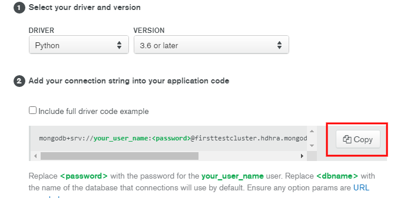

Paste it into the right side of the MONGO_URI variable in the env file, and replace `<password>` with the password for your username. Replace `<dbname>` with the name of the database.

### 5. Create the search index on MongoDB

Best thing to do is to create the index using the python interpreter. 
 - In your terminal type `python3` (or `python` depending on your system setup). This should open the python interpreter. 
  - You then type `from app import mongo`. This imports the database variable.
  - Create the text index with `mongo.db.recipes.create_index([("title", "text"), ("short_description", "text")])`. This creates the text search index on the 'title' and 'short_description' fields.
  - Type `quit()` to exit Python interpreter.

### 6. If you want to turn on debug

In the last line of app.py file change from `debug=False` to `debug=True`

### 7. Run the app

You will then be able to run the app locally by typing `python app.py` or  `flask run`. 

## Deployment to Heroku

The web app is hosted on Heroku. The steps to deploy the local app to Heroku are as follows:

### 1. Sign up and log in to Heroku

In Heroku, create an app.  

### 2. Install the Heroku CLI and login
If you do not have it already, download and install the [Heroku CLI](https://devcenter.heroku.com/articles/heroku-cli).
In terminal, login with:

```
$ heroku login
```

and login through the browser/preview window. If you’d prefer to stay in the CLI to enter your credentials, you may run `heroku login -i`

### 3. Connect repo to Heroku

In Heroku go to Settings tab. You will find the Heroku git url here. Then in terminal type:

```
$ git remote add heroku <your heroku git url>
```

Heroku is now set a remote.  

### 4. Push to Heroku
You can just push the code to Heroku with the command: 
```
$ git push -u heroku master
```

Alternatively, you can also link a Github repository to Heroku to deploy automatically from GitHub, under the Deploy tab. 


### 5. Set environment variables

In the Settings tab, under Config Vars, add the env variables (SECRET_KEY, MONGO_DBNAME, MONGO_URI) we set in the local development, as well as IP to 0.0.0.0 ansd PORT to 5000. Like so:

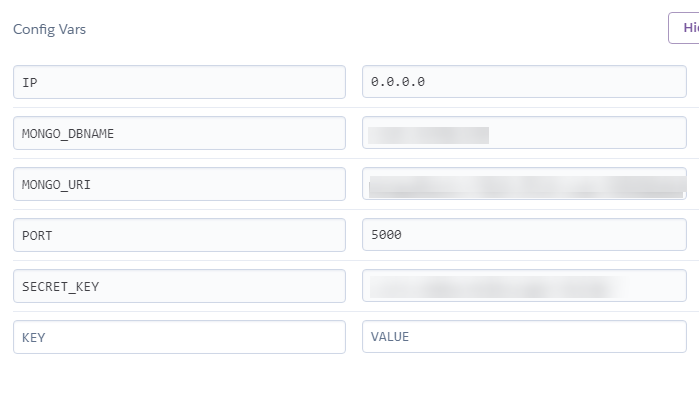

### 6.

You should be able to open the app now, or you might need to Restart all Dynos under the 'More' button on the top right in Heroku.

## Issues I had to overcome

### Formatting of Ingredients and method

I wanted my ingredients on different lines, as they are easier to read and then I could style them a bit nicer, but when my Ingredients were output it was all in what looked like one paragraph with no line breaks. I thought it was to do with the input field not saving the line breaks. But after going down the wrong path with that, it turned out the ingredients just needed the CSS property 'white-space' set to pre-wrap.

### Delete category in modal window was deleting the wrong category.

I wanted to warn the user about the deletion of a category by having a pop-up warning, otherwise it just happened as soon as they press the delete button. But when I first had the delete button in the pop-up it was deleting the first category and not the one I clicked. This worked fine for the delete recipe button, but that was a single page and not looping through the recipes. The problem was that the modal had to be inside the 'categories' loop or I could not get the category id to tell it which category to delete. But this then generated multiple modals with the id of 'delete-category', which is what the modal trigger (Delete button) was looking for. But it comes across the first `id="delete-category` which contains the first category on the page, and deletes that one.

So my first thought was to pass the category name into the modal id so like `<div id="delete-{{category.category_name}}"`. However this leads to an issue where, because the category can be entered by a user, the html ID for this can have spaces and odd characters, and also might not be unique, I might have multiple categories with the same name, hence the duplicate ID issue for the modal again. 

So I knew I need something unique that users do not have control over, so the category id is what I used and it works for this modal with no duplications.

### Cursor not found error on All Recipe page after putting 

After putting the if-else on the all-recipes.html template which outputs "No recipes found" on a search query, when I went to All Recipes I was getting an error: `object of type 'cursor' has no len()`. Yet the page worked when I had results to show. I searched online to try to find out what that meant, but was not really getting or understanding answers I read. But I knew my view for the search worked, so I compared this with all_recipes view. My all recipes was simply sending the recipes to the template as a dictionary : `recipes=mongo.db.recipes.find({"course_name": course_name})`, but my search was sending a list like: `recipes = list(mongo.db.recipes.find({"$text": {"$search": query}}))`. So I changed my all_recipes to use the list() method and that fixed the error.

### Using the select category dropdown with POST allowed for error

I was first using the POST method from the category select dropdown form on the homepage. The view worked and would display the correct recipes from the selected category, but the url was simply /category. If you reload that page then the browser asked to resubmit the form and still works. But if the user put their cursor at the end of the url and hit return (or copied an pasted into new tab), an error would occur, which would say 'category_name' is not defined. Which makes sense because we the category_name was not passed through the view. But this is not good because a user can generate this error quite simply. It would also mean you could not share a url for this results page.

So I changed the form method to GET and got the category selected using request.args. This way the category parameter is passed through the url like /category/?category_name=Chicken. So this url can be reloaded, or copied, shared and opened in a new window and still works. So the user cannot generate an error like was possible with POST.

Similarly I then changed the text search form and view to use the GET method, otherwise reloading the search result page cause an error. But using the GET method makes the search results url work if shared or copied to a new window.

### Materialize select dropdown would not work on mobile

The Materialize select for selecting a category on the search by category was not working on a mobile device. The options would flash up for a fraction of a second and then disappear and would not show again. This was tricky to figure out as it did not happen in the developer tools responsive mode on a desktop. Also the html for the select element is generated by materialize from my html in the template and materialize's javascript so is not technically something I developed.

I could not figure it out from my site, so I decided I would create a pen on [codepen](https://codepen.io/bourkekev/pen/poybvQd) with just the basic html and required js css for materialize and test it there. So when I checked this pen on mobile the issue did not happen and it worked fine. So there was a problem somehow with my site. When I looked at the materialize input (that simulates a select) it has a class `dropdown-trigger`. But also the dropdown in the navigation had a link with a class `dropdown-trigger`. So I removed the jQuery [materialize's docs](https://materializecss.com/navbar.html#navbar-dropdown) say to include from their example, and tested the select again on mobile. This time it worked as expected.

So I had to change the class on the dropdown trigger in the navigation to be different than the select dropdown trigger, and that fixed the conflict.

### Select category dropdown went under nav

The select category dropdown would open upwards if the screen was landscape and below a certain height (like on a small laptop), which turned out to be 672px high. This put the greyed out 'Select category' text and half of the first category beneath the header, so it was hard to select. I thought it would not be too difficult to just change the z-index on the header or dropdown to get it above the header but this turned out more tricky than imagined, because of the DOM structure and that materialize generates the select dropdown and 'sidenav-overlay' (darkened overlay when activating the mobile nav). I could get the header below the dropdown setting its z-index to 2, but this caused a problem with the 'sidenav-overlay' which then appeared over everything including the mobile nav. The mobile nav is inside the nav in the header, but the overlay is at the same DOM level as the header.

So I thought a better solution would be to set a max-height on the select dropdown just for when the screen height gets too small and is still landscape. This way, when the select dropdown goes up, it will not go below the header.

## Credits and References

### Design and Research
 I took inspiration for this site from the following places:
 - [Kitchen Stories](https://www.kitchenstories.com/en/stories/new-on-kitchen-stories-upload-your-own-recipes)
 - [AllRecipes](http://dish.allrecipes.com/customer-service/submit-your-recipes/)
 - [Food Network](https://foodnetwork.co.uk/)
 - [Epicurious](https://www.epicurious.com/)
 - [EatingWell](http://www.eatingwell.com/)
 - [Food.com](https://www.food.com/)
 - [Yummly](https://www.yummly.co.uk/)
 - [Pinch of Yum](https://pinchofyum.com/)
 - [Flavor & The Menu](https://www.getflavor.com/recipes-home/)
 - [The Kitchn](https://www.thekitchn.com/pesto-chicken-22925256)
 - [Healthy Fitness Meals](https://healthyfitnessmeals.com/recipe-index/)
 - [Napolina](https://www.napolina.com/recipes/30-minute/rigatoni-with-goats-cheese-and-spinach)

### Technical
 - For general references for Python and Flask I used my Code Institute notes, [MDN web docs](https://developer.mozilla.org/en-US/), [w3schools](https://www.w3schools.com/js/default.asp), [Python Offical Docs](https://www.python.org/doc/), and [Flask documentation](https://flask.palletsprojects.com/en/1.1.x/).
 - MongoDB Text Search - https://docs.mongodb.com/manual/text-search/ and https://docs.mongodb.com/manual/core/index-text/
 - For Python's datetime formatting I referenced https://www.programiz.com/python-programming/datetime/strftime
 - Form field character count - [w3schools oninput](https://www.w3schools.com/jsref/event_oninput.asp) and [w3schools output](https://www.w3schools.com/tags/tag_output.asp). And also [developer.mozilla.org](https://developer.mozilla.org/en-US/docs/Web/API/GlobalEventHandlers/oninput) for oninput reference.
 - Information on message flashing I referenced [Flask Flash docs](https://flask.palletsprojects.com/en/1.1.x/patterns/flashing/)
 - Validation JavaScript for Materialize select - This script was supplied by Code Institute, because by default the materialize select provides no feedback on a required select field that is left blank.
 - Compare registration passwords - I reference [this article](https://www.the-art-of-web.com/javascript/validate-password/#section_5) when looking for a Javascript way to change the 'Confirm Password' field notification of wrong pattern.
 - Form input count - The text area fields have a max number of characters allowed so I added a simple JavaScript character count on input to give the user an idea of how many characters they have used. This was based on references from [w3schools oninput](https://www.w3schools.com/jsref/event_oninput.asp) and [w3schools output](https://www.w3schools.com/tags/tag_output.asp). (P.S. I changed how this worked, and used the materialize option for character count which I was not aware of at the time.)
 
### Content

 - Some text content adapted from [thekitchn.com](https://www.thekitchn.com/) and [allrecipes.com](http://dish.allrecipes.com/customer-service/submit-your-recipes/).
 - Actual example recipes were take from [allrecipes](https://www.allrecipes.com/) and [eatingwell.com](http://www.eatingwell.com/)
 
### Media

The photos and vectors used in this site were obtained from:

 - Database Diagram designed on [QuickDBD](https://www.quickdatabasediagrams.com/).
 - Logo was purchased from [Shutterstock](https://www.shutterstock.com/image-vector/vector-logo-template-cookbook-ladle-recipe-620961650) and I edited the colours and added the logo text.
 - Home Search and page title panels purchased from Shutterstock. [Home search](https://www.shutterstock.com/image-photo/traditional-russian-pelmeni-ravioli-dumplings-meat-597536570) and other pages [title panel](https://www.shutterstock.com/image-photo/cooking-utensils-spices-on-stone-kitchen-1513515293).
 - All recipes page search panel image from [Ella Olsson](https://www.pexels.com/@ella-olsson-572949?utm_content=attributionCopyText&utm_medium=referral&utm_source=pexels) on [Pexels](https://www.pexels.com/photo/photo-of-vegetable-salad-in-bowls-1640770/).
 - Image for No Recipe Image by [Daria Yakovleva](https://pixabay.com/users/daria-yakovleva-3938704/) on [Pixabay](https://pixabay.com/photos/food-products-rustic-vegetables-1898194/).
 - 404 image by [laurentvalentinjospi0](https://pixabay.com/users/laurentvalentinjospi0-986947/) on [Pixabay](https://pixabay.com/photos/dishes-white-plate-stemware-938747/).
 - Courses illustrations were purchased on [shutterstock](https://www.shutterstock.com/image-vector/menu-icons-172235042) and the ['other' course on shutterstock here](https://www.shutterstock.com/image-vector/vector-hand-drawn-food-meal-on-201739760).
 - Extended Material Design icons from [Material Design Icons](https://materialdesignicons.com/) and are packaged under the [SIL Open Font License 1.1.](https://github.com/Templarian/MaterialDesign/blob/master/LICENSE)
 - The favicons were generated at https://realfavicongenerator.net/

The recipes images I uploaded to Cloudinary and for testing purposes came from the following sources (mostly Pixabay):

 - [Salmon Teriaki](https://pixabay.com/photos/food-salmon-teriyaki-fish-eat-712665/)
 - [Vegetable Skewer](https://pixabay.com/photos/vegetable-skewer-paprika-tomato-3317060/)
 - [Cheesecake](https://pixabay.com/photos/blur-cake-cheesecake-cinnamon-1869227/)
 - [Asparagus Steak](https://pixabay.com/photos/asparagus-steak-veal-steak-veal-2169305/)
 - [Pork Spare Ribs](https://pixabay.com/photos/spare-ribs-grill-bbq-sauce-2225208/)
 - [Smoked Salmon Canapes](https://pixabay.com/photos/appetizer-salmon-canape-cheese-2802/)
 - [Pancakes](https://pixabay.com/photos/pancakes-maple-syrup-sweet-food-2291908/)
 - [Potato and Broccoli Bake](https://pixabay.com/photos/broccoli-potato-casserole-cheese-1804446/)
 - [Tomato and Basil Pizza](https://pixabay.com/photos/pizza-basil-garlic-crust-sauce-1209748/)
 - [Grilled Chicken](https://pixabay.com/photos/grilled-chicken-quinoa-salad-1334632/)
 - [Chocolate Cupcakes](https://pixabay.com/photos/cupcakes-dessert-frosting-food-690040/)
 - [Ribeye Steak](https://www.freepik.com/free-photo/fine-cooked-ribeye-tenderloin-piece-paper_5447680.htm#page=1&query=ribeye&position=15)

### Acknowledgements

 - Thanks to my mentor Anthony Ngene for his suggestions and his time.
 - [Simen Daehlin](https://github.com/Eventyret) - [The Padwan Project](https://github.com/Eventyret/Padawan)
 - Thanks to those on Slack for reviewing my project and making suggestions.