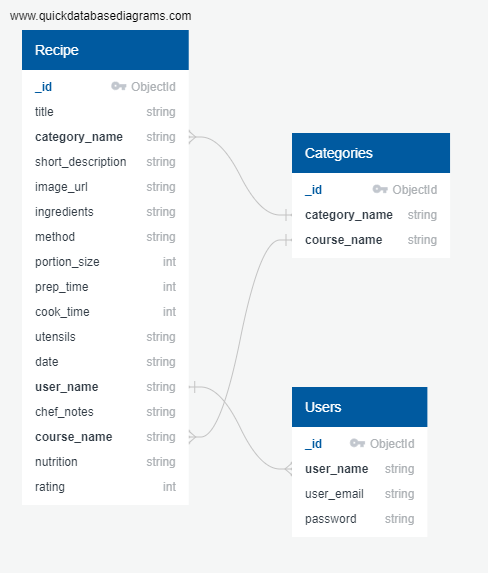

# Milestone 3 - Your Recipe Hub - by Kevin Bourke

## UX

I wanted ...
 - [x] To do something

### User Stories

This section provides insight into the UX process, focusing on who this website is for, what it is that they want to achieve and how this project is the best way to help them achieve these things.  

#### As a User

 

#### As a developer

### Strategy

The goals of this type of website are to:

1. 

### Scope

This section determines what the users should be able to do on the website. Users should be able to:

1. 

### Structure

### Skeleton

This formed the basis of my wireframes, which were created in Balsamiq:

### Surface

### Database Schema

Based on the functionality required and the data to be stored, I created my database structure.

## Technologies Used

### Languages and Frameworks
1. HTML
2. CSS
3. Javascript 
4. Python
5. [Flask Framework](https://palletsprojects.com/p/flask/)
6. Jinja templating for Python
4. [Bootstrap Framework](https://getbootstrap.com/)
5. [Font Awesome](https://fontawesome.com/)
6. Google Fonts
9. [JQuery](https://jquery.com) - The project uses **JQuery** to simplify DOM manipulation, and animation of certain elements.

### Tools Used
1. [VS Code](https://code.visualstudio.com/) and [Brackets](http://brackets.io/) code editors.
2. [Git](https://git-scm.com/) - Installed on local devices and integrated with VS Code and Brackets, to allow version control.
3. [GitHub](https://github.com/) - Used a repository for the project files and previous versions. Also used to deploy the website.
4. [Balsamiq](https://balsamiq.com/) - Used for creating wireframes for different variations and different screen sizes.
5. I used Photoshop and Illustrator for image and svg manipulation.
6. [TinyPNG](https://tinypng.com/) - To keep transparent png sizes to a minimum I used the online png compressing service [TinyPNG](https://tinypng.com/), as well as the desktop application.
7. [Coolor](https://coolors.co/) - Used top help determine the colour scheme.
8. [The Padwan Project](https://github.com/Eventyret/Padawan) - While I did not use this tool to generate my project's starting point as I started with [Code Institute's Full template](https://github.com/Code-Institute-Org/gitpod-full-template), I did use it as a reference.

## Features
 
### Existing Features

#### Minor Features
Expand the sections below for more info on details

  
<strong>Skip to main content</strong>

 There is a 'Skip to main content' link just inside the body tag for accessibility for screenreaders. The main content is not usually the first thing on a web page. Keyboard and screen reader users generally must navigate a long list of navigation links, sub-lists of links, corporate icons, site searches, and other elements before ever arriving at the main content. This is then hidden from view with the bootstrap class 'sr-only', however when it receives focus from keyboard it becomes visible, by basically reversing the Bootstrap CSS properties on focus. This is based on accessibility recommendations from https://webaim.org/techniques/skipnav/. This can be checked by pressing tab when a pages loads.
 

### Features to consider implementing in the future

1. 

## Testing

Please see [Testing Document](TESTING.md) for all my testing

## Deployment

To run locally, you can clone this repository directly into the editor of your choice by pasting `git clone https://github.com/Bourkekev/ms3-your-recipe-hub.git` into your terminal. To cut ties with this GitHub repository, type `git remote rm origin` into the terminal.

## Issues I had to overcome

## Credits and References

### Design and Research
 I took inspiration for this site from the following places:
 - 

### Technical
 - For general references for Python and Flask I used my Code Institue notes, [MDN web docs](https://developer.mozilla.org/en-US/), [w3schools](https://www.w3schools.com/js/default.asp), [Python Offical Docs](https://www.python.org/doc/).
 

### Content

 
### Media
- The photos and vectors (except logo) used in this site were obtained from:

 - Ha'Penny Bridge - [Shutterstock](https://www.shutterstock.com/g/madrugadaverde)
 - Fictional logo was designed on https://www.freelogodesign.org/

 - The favicons were generated at https://realfavicongenerator.net/

### Acknowledgements

 - Thanks to my mentor Anthony Ngene for his suggestions and his time.
 - [Simen Daehlin](https://github.com/Eventyret) - [The Padwan Project](https://github.com/Eventyret/Padawan)
 - Thanks to those on Slack for reviewing my project and making suggestions.