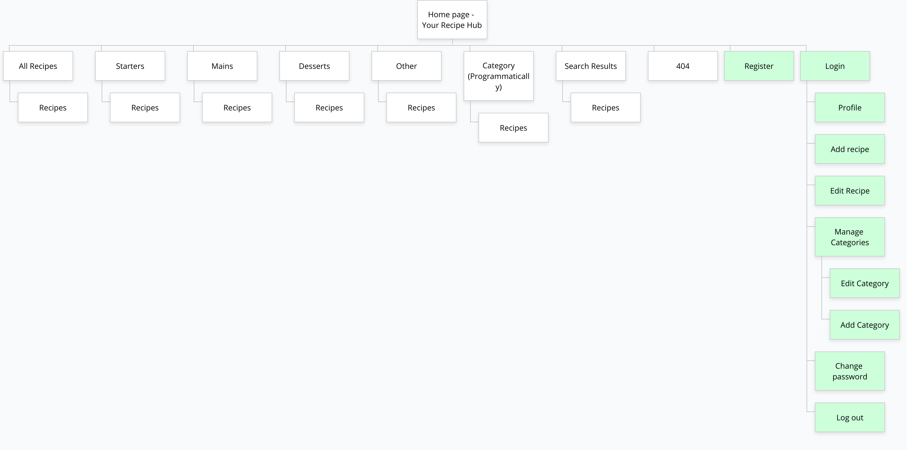

# Milestone 3 - Your Recipe Hub - by Kevin Bourke

Your Recipe Hub is a recipe website where users can search for recipes via text search or categories. If they wish they can also submit their own recipes to the site. If they register, users can read, create, update and delete recipes. There many sites in existence that have this kind of functionality already, such as [Kitchen Stories](https://www.kitchenstories.com/en) and [Allrecipes](https://www.allrecipes.com/). Essentially the users would be building a database of recipes for public use.

## UX

I wanted the site to have 3 main overarching features.
 - [x] Users should be able to browse by category or search the site for recipes.
 - [x] If they like, users should be able to register and login to the site.
 - [x] If logged in, users should be able to upload their own recipes.

### User Stories

This section provides insight into the UX process, focusing on who this website is for, what it is that they want to achieve and how this project is the best way to help them achieve these things. It expands on the main features as were listed above.

#### As a User who is just using the site as a resource for recipe ideas I would like to:

- [x] Browse recipes by food course.
- [x] Browse recipes by food category.
- [x] Search the site by keyword for recipes easily.
- [x] Easily see the time required for each recipe while browsing.
- [x] Easily view latest Recipes.

#### As a User who would like to contribute recipes to the site I would also like to:

- [x] Register for an account.
- [x] Login to my account.
- [x] Submit my own recipes to be shown on the website.
- [x] Use the site as a repository for my own recipes.
- [x] Easily view recipes I have submitted.
- [x] Edit my own recipes, but other users cannot edit or delete my recipes.
- [x] Delete my own recipes.
- [x] Add new categories.
- [ ] Delete categories.
- [x] Log out of my account.
- [x] Get clear messages if something does not work, like a username is already taken.

#### As admin or the site owner I would like to do all the above as well as:

- [x] Edit or Remove all recipes.
- [ ] Edit or remove all categories.
- [ ] Manage Courses.
- [ ] Remove Users if required.

#### As a developer

I include this here to explain what I, as a developer, wanted to get out of this project. 

 - To provide an easy to use, online recipe repository, which provides users with full CRUD functionality.
 - To improve my knowledge of Python, Flask and Jinja templating, with a practical project.
 - To learn about basic user authentication.
 - To learn about MongoDB indexing for text searches.
 - To learn to use the [Materialize Framework](https://materializecss.com/), to see how it compares to the likes of Bootstrap.
 - Connecting a web app to a database to create and store data, in this case in a non-relational database, MongoDB.
 - To learn to deploy the web app through Heroku.

### Strategy

The goals of this type of website are to:

1. Be a resource for users to get recipe ideas.
2. Allow users to submit and manage their own recipe ideas.
3. Be a repository of recipes for a registered user, i.e easily access their own submitted recipes.
4. To give ratings or feedback on recipes.
5. To give admins full control over all users recipes and categories, and also courses.

### Scope

This section determines what the users should be able to do on the website. Users should be able to:

1. 

### Structure

To list the pages I needed and to visualise the site structure, I designed my visual sitemap in Gloomap. In the sitemap below, the pages marked in green represent site User (logged in) pages:

I also listed out the features I wanted on the homepage.

### Skeleton

I sketched up some very rough ideas on paper and then designed the final wireframes, which were created in Balsamiq:

- [Home page on desktop wireframe](README_resources/wireframes/homepage-desktop.png)
- [Home page on mobile wireframe](README_resources/wireframes/homepage-mobile.png)
- [All Recipes on desktop wireframe](README_resources/wireframes/all-recipes-desktop.png)
- [All Recipes on mobile wireframe](README_resources/wireframes/all-recipes-mobile.png)
- [Recipe page on desktop wireframe](README_resources/wireframes/recipe-page-desktop.png)
- [Recipe page on mobile wireframe](README_resources/wireframes/recipe-page-mobile.png)
- [Add Recipe on desktop wireframe](README_resources/wireframes/add-recipe-desktop.png)
- [Add Recipe on mobile wireframe](README_resources/wireframes/add-recipe-mobile.png)
- [Recipes Category on desktop wireframe](README_resources/wireframes/category-recipes-desktop.png)
- [Recipes Category on mobile wireframe](README_resources/wireframes/category-recipes-mobile.png)
- [Sign up on desktop wireframe](README_resources/wireframes/sign-up-desktop.png)
- [Sign up on mobile wireframe](README_resources/wireframes/sign-up-mobile.png)

There is also a login page which is very similar to the sign up page except with no email field and different intro text, and also an Edit Recipe page which is basically identical to Add Recipe except the values are pre-populated from the database.

Also note, my wireframes and sitemap did change slightly during development as I learned more about how best to display certain pages, like recipe categories or the search results page. The knowledge I gained throughout the project would allow me a much better understanding of what was possible or what might work best for future projects.

### Surface

An obvious colour choice for representing healthy food is green. Green stands for nature and growth according to this [99designs article](https://99designs.ie/blog/tips/color-psychology/), and it is also a literal representation of healthy foods, like vegetables and salads.

I wanted the site to be clean and bright. The [Yummly](https://www.yummly.com/) is a good example of this, it is mostly white with green and orange contrasting colours for buttons and other icons.

I researched colour combinations, particularly looking for green and another contrasting colour. I liked the number 17 "Teal, coral, turquoise and grey" palette on this [article](https://99designs.ie/blog/creative-inspiration/color-combinations/), but wanted to bring the green closer to a leafy green colour and also make the coral colour a bit more vibrant. I used [Coolors](https://coolors.co/) and picked a nice green #25b35f as my base green, and generated different colour palettes. It actually generated one that was quite similar to the palatte above, with oranges and greys. I felt the orange was a bit too pastel and light, so I just picked a different shade of that orange. I also lightened the shade of the lighter grey, as I imagined using it as a background colour where there might be text on it, so wanted to make sure dark text would be able to stand out on the grey.

This was my final palatte:

You can also see it completely in [PDF format here](README_resources/colour-palette-your-recipe-hub.pdf).

Colours for buttons, like edit and delete were based on different shades of materialize colours.

#### Fonts

On all the recipe websites I researched, I liked the font used on [Napolina](https://www.napolina.com/recipes/30-minute/rigatoni-with-goats-cheese-and-spinach) as a heading, it really stood out as being slightly different with the narrow 's'. However this font is an Adobe Font called 'Mostra Nuova' and would require a licence (Adobe subscription). So I used Google font's filter options to find a narrow, sans-serif to look for a font with similar properties. The [Yanone Kaffeesatz](https://fonts.google.com/specimen/Yanone+Kaffeesatz) font was a more interesting font than most, as it has some slightly different shaped characters than most other fonts of similar type, the k, r and e being good examples. Google fonts has suggestions for font pairings that would work for each particular font, so I looked throught these for a nice body font. I wanted this font to be wider and easier to read at small sizes and had a bit of a constrast with the headings, so I decided [Montserrat](https://fonts.google.com/specimen/Montserrat) would work well.
This [canva article](https://www.canva.com/learn/the-ultimate-guide-to-font-pairing/) also shows Montserrat working well with Narrower heading fonts.

### Database Schema

Based on the functionality required and the data to be stored, I created my database structure. The Recipe and Categories documents (or tables) would have fields of the same name, so a recipe can be saved to a course type and a category.

## Technologies Used

### Languages and Frameworks
1. HTML
2. CSS
3. Javascript 
4. Python
5. [Flask Framework](https://palletsprojects.com/p/flask/)
6. Jinja templating for Python
7. [MongoDB Database](https://www.mongodb.com/)
8. [Heroku hosting platform](https://heroku.com)
9. [Materialize Framework](https://materializecss.com/)
10. [Font Awesome](https://fontawesome.com/)
11. Google Fonts
12. [JQuery](https://jquery.com) - The project uses **JQuery** to simplify DOM manipulation, and animation of certain elements.

### Tools Used
1. [VS Code](https://code.visualstudio.com/) and [Brackets](http://brackets.io/) code editors.
2. [Git](https://git-scm.com/) - Installed on local devices and integrated with VS Code and Brackets, to allow version control.
3. [GitHub](https://github.com/) - Used a repository for the project files and previous versions. Also used to deploy the website.
4. [Balsamiq](https://balsamiq.com/) - Used for creating wireframes for different variations and different screen sizes.
5. I used Photoshop and Illustrator for image and svg manipulation.
6. [TinyPNG](https://tinypng.com/) - To keep transparent png sizes to a minimum I used the online png compressing service [TinyPNG](https://tinypng.com/), as well as the desktop application.
7. [Coolor](https://coolors.co/) - Used top help determine the colour scheme.
8. [The Padwan Project](https://github.com/Eventyret/Padawan) - While I did not use this tool to generate my project's starting point as I started with [Code Institute's Full template](https://github.com/Code-Institute-Org/gitpod-full-template), I did use it as a reference.
9. [Gloomaps](https://www.gloomaps.com/) - For creating my sitemap.

## Features
 
### Existing Features

#### Users can only edit their own Recipes
#### User can view their own recipes

By navigating to their profile page a user can view all the recipes that they have submitted to the site.

#### Minor Features
Expand the sections below for more info on details

  
<strong>Responsive images</strong>

As the recipe images are provided by external users I could not make these smaller for mobile.
To allow me to use a different image for the 'no recipe image' for mobile I used the `<picture>` element. This allowed me to create a smaller image just for a mobile.

  
<strong>Password matching on Register</strong>

There is a 'Confirm Password' field on the register form which compares the 2 password fields, basically by setting the pattern attribute of the 'Confirm password' field to the first using simple JavaScript onchange function. The basics of this are very simple, the onchange function on the first password field sets the pattern attribute on the second field to be the value of the first field.
If they do not match, on submission the browser notifies the user "Please match the format requested", which means the password comparing is working but the notification is not clear in what it is asking for. This is the browser default for a pattern not matching, but ideally it should says something like "Passwords do not match". I thought I was going to have to find some javascript to change this and was looking on [this article](https://www.the-art-of-web.com/javascript/validate-password/#section_5) and found that the simplest thing to do is to use a title attribute, and most browsers will automatically display that text in case of a missing value or pattern mismatch. So I did not include any additional Javascript for this for the moment.
I was also going to include a [RegEx polyfill](https://www.the-art-of-web.com/javascript/validate-password/#section_7) because if your password1 contains a '*' or other special regular expression characters, the pattern for password2 can become invalid. But at the moment my password1 field pattern attribute is actually set to just characters from a-z or numbers so this is not required.

  
<strong>Skip to main content</strong>

 There is a 'Skip to main content' link just inside the body tag for accessibility for screen readers. The main content is not usually the first thing on a web page. Keyboard and screen reader users generally must navigate a long list of navigation links, sub-lists of links, corporate icons, site searches, and other elements before ever arriving at the main content. This is then hidden from view with the bootstrap class 'sr-only', however when it receives focus from keyboard it becomes visible, by basically reversing the Bootstrap CSS properties on focus. This is based on accessibility recommendations from https://webaim.org/techniques/skipnav/. This can be checked by pressing tab when a pages loads.
 

##### Form input count
The text area fields have a max number of characters allowed so I added a simple JavaScript character count on input to give the user an idea of how many characters they have used. This was based on references from [w3schools oninput](https://www.w3schools.com/jsref/event_oninput.asp) and [w3schools output](https://www.w3schools.com/tags/tag_output.asp).

### Features to consider implementing in the future

 - Additional Categorisation by Cuisine (Italian, Chinese etc...) and tags, like for specific ingredients like eggs or potatoes.

## Testing

Please see [Testing Document](TESTING.md) for all my testing

## Deployment

To run locally, you can clone this repository directly into the editor of your choice by pasting `git clone https://github.com/Bourkekev/ms3-your-recipe-hub.git` into your terminal. To cut ties with this GitHub repository, type `git remote rm origin` into the terminal.

### Create the search index

Best thing to do is to create the index using the python interpreter. 
 - In your terminal type `python3` (or `python` depending on your system setup). This should open the python interpreter. 
  - You then type `from app import mongo`. This imports the database variable.
  - Create the text index with `mongo.db.recipes.create_index([("title", "text"), ("short_description", "text")])`. This creates the text search index on the 'title' and 'short_description' fields.
  - Type `quit()` to exit Python interpreter.

## Issues I had to overcome

### Formatting of Ingredients and method

I wanted my ingredients on different lines, as they are easier to read and then I could style them a bit nicer, but when my Ingredients were output it was all in what looked like one paragraph with no line breaks. I thought it was to do with the input field not saving the line breaks. But after going down the wrong path with that, it turned out the ingredients just needed the CSS property 'white-space' set to pre-wrap.

### Delete category in modal window was deleting the wrong category.

I wanted to warn the user about the deletion of a category by having a pop-up warning, otherwise it just happened as soon as they press the delete button. But when I first had the delete button in the pop-up it was deleting the first category and not the one I clicked. This worked fine for the delete recipe button, but that was a single page and not looping through the recipes. The problem was that the modal had to be inside the 'categories' loop or I could not get the category id to tell it which category to delete. But this then generated multiple modals with the id of 'delete-category', which is what the modal trigger (Delete button) was looking for. But it comes across the first `id="delete-category` which contains the first category on the page, and deletes that one.

So my first thought was to pass the category name into the modal id so like `<div id="delete-{{category.category_name}}"`. However this leads to an issue where, because the category can be entered by a user, the html ID for this can have spaces and odd characters, and also might not be unique, I might have multiple categories with the same name, hence the duplicate ID issue for the modal again. 

So I knew I need something unique that users do not have control over, so the category id is what I used and it works for this modal with no duplications.

### Cursor not found error on All Recipe page after putting 

After putting the if-else on the all-recipes.html template which outputs "No recipes found" on a search query, when I went to All Recipes I was getting an error: `object of type 'cursor' has no len()`. Yet the page worked when I had results to show. I searched online to try to find out what that meant, but was not really getting or understanding answers I read. But I knew my view for the search worked, so I compared this with all_recipes view. My all recipes was simply sending the recipes to the template as a dicitonary : `recipes=mongo.db.recipes.find({"course_name": course_name})`, but my search was sending a list like: `recipes = list(mongo.db.recipes.find({"$text": {"$search": query}}))`. So I changed my all_recipes to use the list() method and that fixed the error.

### Using the select category dropdown with POST allowed for error

I was first using the POST method from the category select dropdown form on the homepage. The view worked and would display the correct recipes from the selected category, but the url was simply /category. If you reload that page then the browser asked to resubmit the form and still works. But if the user put their cursor at the end of the url and hit return (or copied an pasted into new tab), an error would occur, which would say 'category_name' is not defined. Which makes sense because we the category_name was not passed through the view. But this is not good because a user can generate this error quite simply. It would also mean you could not share a url for this results page.

So I changed the form method to GET and got the category selected using request.args. This way the category parameter is passed through the url like /category/?category_name=Chicken. So this url can be reloaded, or copied, shared and opened in a new window and still works. So the user cannot generate an error like was possible with POST.

Similary I then changed the text search form and view to use the GET method, otherwise reloading the search result page cause an error. But using the GET method makes the search results url work if shared or copied to a new window.

### Materialize select dropdown would not work on mobile

The Materialize select for selecting a category on the search by category was not working on a mobile device. The options would flash up for a fraction of a second and then disappear and would not show again. This was tricky to figure out as it did not happen in the developer tools responsive mode on a desktop. Also the html for the select element is generated by materialize from my html in the template and materialize's javascript so is not technically something I developed.

I could not figure it out from my site, so I decided I would create a pen on [codepen](https://codepen.io/bourkekev/pen/poybvQd) with just the basic html and required js css for materialize and test it there. So when I checked this pen on mobile the issue did not happen and it worked fine. So there was a problem somehow with my site. When I looked at the materialize input (that simultates a select) it has a class `dropdown-trigger`. But also the dropdown in the navigation had a link with a class `dropdown-trigger`. So I removed the jQuery [materialize's docs](https://materializecss.com/navbar.html#navbar-dropdown) say to include from their example, and tested the select again on mobile. This time it worked as expected.

So I had to change the class on the dropdown trigger in the navigation to be different than the select dropdown trigger, and that fixed the conflict.

### Select category dropdown went under nav

The select category dropdown would open upwards if the screen was landscape and below a certain height (like on a small laptop), which turned out to be 672px high. This put the greyed out 'Select category' text and half of the first category beneath the header, so it was hard to select. I thought it would not be too difficult to just change the z-index on the header or dropdown to get it above the header but this turned out more tricky than imagined, because of the DOM structure and that materialize generates the select dropdown and 'sidenav-overlay' (darkened overlay when activating the mobile nav). I could get the header below the dropdown setting its z-index to 2, but this caused a problem with the 'sidenav-overlay' which then appeared over everything including the mobile nav. The mobile nav is inside the nav in the header, but the overlay is at the same DOM level as the header.

So I thought a better solution would be to set a max-height on the select dropdown just for when the screen height gets too small and is still landscape. This way, when the select dropdown goes up, it will not go below the header.

## Credits and References

### Design and Research
 I took inspiration for this site from the following places:
 - 

### Technical
 - For general references for Python and Flask I used my Code Institute notes, [MDN web docs](https://developer.mozilla.org/en-US/), [w3schools](https://www.w3schools.com/js/default.asp), [Python Offical Docs](https://www.python.org/doc/), and [Flask documentation](https://flask.palletsprojects.com/en/1.1.x/).
 - For Python's datetime formatting I referenced https://www.programiz.com/python-programming/datetime/strftime
 - Form field character count - [w3schools oninput](https://www.w3schools.com/jsref/event_oninput.asp) and [w3schools output](https://www.w3schools.com/tags/tag_output.asp). And also [developer.mozilla.org](https://developer.mozilla.org/en-US/docs/Web/API/GlobalEventHandlers/oninput) for oninput reference.
 - Information on message flashing I referenced [Flask Flash docs](https://flask.palletsprojects.com/en/1.1.x/patterns/flashing/)
 - Validation JavaScript for Materialize select - This script was supplied by Code Institute, because by default the materialize select provides no feedback on a required select field that is left blank.
 - Compare registration passwords - I reference [this article](https://www.the-art-of-web.com/javascript/validate-password/#section_5) when looking for a Javascript way to change the 'Confirm Password' field notification of wrong pattern.
 
### Content

 - Some text content adapted from [thekitchn.com](https://www.thekitchn.com/) and [allrecipes.com](http://dish.allrecipes.com/customer-service/submit-your-recipes/).
 - Actual example recipes were take from [allrecipes](https://www.allrecipes.com/) and [eatingwell.com](http://www.eatingwell.com/)
 
### Media
- The photos and vectors used in this site were obtained from:

 - Logo was purchased from [Shutterstock](https://www.shutterstock.com/image-vector/vector-logo-template-cookbook-ladle-recipe-620961650)
 -

 - The favicons were generated at https://realfavicongenerator.net/

### Acknowledgements

 - Thanks to my mentor Anthony Ngene for his suggestions and his time.
 - [Simen Daehlin](https://github.com/Eventyret) - [The Padwan Project](https://github.com/Eventyret/Padawan)
 - Thanks to those on Slack for reviewing my project and making suggestions.