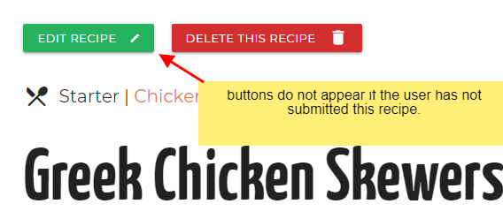
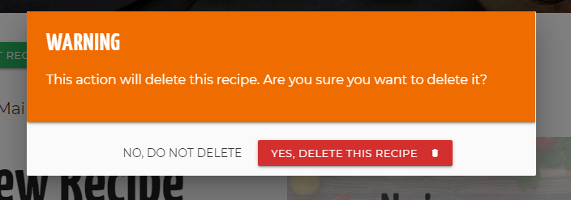

# Testing

## Test Recipe Images
I have a number of images stored on cloudinary which can be used for the image url for testing purposes. They can be found at the bottom of this file [here](#Test-Images).

## User testing and defensive design

This section shows how the site works and gives feedback from the users point of view (user stories).

 ### A user wants to search by category

1. On the homepage try to submit the empty 'Select Category' without
 selecting an option and see that a message about selecting from the list appears:

2. If you search for a category that has no recipes the search result page will tell you this:

3. You can also click on the category links in the footer to browse by category. Again if the category has no recipes the same No recipes found message shows.

### A user wants to search by keyword

1. On the homepage try to submit an empty search field and a warning will show:
   

2. If you search for a term that has no recipes the search result page will tell you this:

### A user wants to browse by course

1. On the homepage or in the nav menu you can click on a course and it will bring you to a page where the recipes in that course type are listed. Again, if there are no recipes in that course type, this is communicated as above.

### A user want to see the latest recipes

On the homepage towards the bottom the last 3 recipes added or edited show here.

### While browsing the user can easily see the time required for each recipe

The card recipes contain information about the total time to complete a recipe, what type of course it is and what portion size it is for.

### A user wants to subscribe to a newsletter
1. Go to the small form in the footer and try to submit the empty form and verify that an error message about the required fields appears.
2. Try to submit the form with an invalid email address and verify that a relevant error message appears.
3. Try to submit the form with all inputs valid and verify that a success message appears.

### Registering for an account

Click on the register link in the nav menu and you are brought to a page to log sign up. All field are required so if any are left blank the error message appears.

If the passwords do not match the error message appears and explains why.

If the username already exists in the database, then you get another error message:

When you successfully register, you are logged in and brought to the profile page. It says your username and allows you to change your password. If you have no recipes you are told you did not submit any, and there is a button to encourage you to submit a recipes.

### Logging in

If you already have an account you can login using the details you registered with and clicking Log In. If you get the username or password wrong you will be notified:

Once you correctly login you are taken to the profile page again.

### Logging Out

Clicking Log Out in the nav menu log you out and you are returned to the login screen, where you are told you have been logged out.

### Submit your own recipes to be shown on the website

When logged in you can click Add Recipe button, or the Add Recipe link in the nav menu you are taken to the form to add a recipe. The title, category, Course, description, ingredients and method are required. You will get the error is you try to submit with any of these fields blank.

If you are not logged in and click the Add Recipe button you will be brought to the login page, and it says you must be logged in to add a recipe:

When you add a new recipe, you are brought to the All Recipes page, notified of succesfull submission.

### You can easily view recipes you have submitted

Go to Profile in the nav menu and all the recipes you added will be listed there.

### Edit or delete only your own Recipes

You can easily edit or delete your own recipes. If you are viewing a recipe that is yours, there are 2 buttons, to edit and delete. The edit and delete buttons do not appear if you have not submitted this recipe.

If you click the delete button, you are given a warning and asked to confirm deletion of the recipe:

### Managing Categories

Currently all users can add, adit and delete categories. You cannot add a category that already exists in the database.

Like delete recipe, if you click the delete button, you are given a warning and asked to confirm deletion of the category.

## Python Testing

I am aware of unit testing in Python but was unable to incorporate automated testing into the project, so all my testing was done manually.

These tests show what happens if you try to access a view directly, when you do not have access or are not passing a parameter.

## Validation

### HTML
I validated the HTML with the [W3 Validation Service](https://validator.w3.org/). 
It told me that the following points that i corrected:
 -  `<nav role="navigation">` is unnecessary for element nav, so I removed that from the nav.
 - The 'required' attribute is not valid on an input of type range.

### CSS
I used the [Autoprefixer Tool](https://autoprefixer.github.io/) to apply browser prefixes.
I validated the CSS with the [W3 CSS Validation Service](https://jigsaw.w3.org/css-validator/) for CSS Level 3 and no errors were found, though it warned me about the vendor prefixes that the Autoprefixer had added.

### Javascript

## Colour Constrast Checking
I used [WebAIM's](https://webaim.org/resources/contrastchecker/) contrast checker to ensure that text on coloured backgrounds is readable and to WCAG AA Standard, especially white text on coloured backgrounds.

## Testing on Browsers, Screen sizes and Devices
I tested the website on the following browsers and devices:
- Chrome on PC and Mac
- Firefox on PC and Mac
- Safari on Mac
- Microsoft Edge V44
- Chrome on Samsung Galaxy S8, Android V9
- Firefox on Samsung Galaxy S8
- Native Browser on Samsung Galaxy S8
- Chrome on Lenovo 10" Tablet, Android V6

## Issues I had to overcome

### Formatting of Ingredients and method

I wanted my ingredients on different lines, as they are easier to read and then I could style them a bit nicer, but when my Ingredients were output it was all in what looked like one paragraph with no line breaks. I thought it was to do with the input field not saving the line breaks. But after going down the wrong path with that, it turned out the ingredients just needed the CSS property 'white-space' set to pre-wrap.

### Delete category in modal window was deleting the wrong category.

I wanted to warn the user about the deletion of a category by having a pop-up warning, otherwise it just happened as soon as they press the delete button. But when I first had the delete button in the pop-up it was deleting the first category and not the one I clicked. This worked fine for the delete recipe button, but that was a single page and not looping through the recipes. The problem was that the modal had to be inside the 'categories' loop or I could not get the category id to tell it which category to delete. But this then generated multiple modals with the id of 'delete-category', which is what the modal trigger (Delete button) was looking for. But it comes across the first `id="delete-category` which contains the first category on the page, and deletes that one.

So my first thought was to pass the category name into the modal id so like `<div id="delete-{{category.category_name}}"`. However this leads to an issue where, because the category can be entered by a user, the html ID for this can have spaces and odd characters, and also might not be unique, I might have multiple categories with the same name, hence the duplicate ID issue for the modal again. 

So I knew I need something unique that users do not have control over, so the category id is what I used and it works for this modal with no duplications.

### Cursor not found error on All Recipe page after putting 

After putting the if-else on the all-recipes.html template which outputs "No recipes found" on a search query, when I went to All Recipes I was getting an error: `object of type 'cursor' has no len()`. Yet the page worked when I had results to show. I searched online to try to find out what that meant, but was not really getting or understanding answers I read. But I knew my view for the search worked, so I compared this with all_recipes view. My all recipes was simply sending the recipes to the template as a dictionary : `recipes=mongo.db.recipes.find({"course_name": course_name})`, but my search was sending a list like: `recipes = list(mongo.db.recipes.find({"$text": {"$search": query}}))`. So I changed my all_recipes to use the list() method and that fixed the error.

### Using the select category dropdown with POST allowed for error

I was first using the POST method from the category select dropdown form on the homepage. The view worked and would display the correct recipes from the selected category, but the url was simply /category. If you reload that page then the browser asked to resubmit the form and still works. But if the user put their cursor at the end of the url and hit return (or copied an pasted into new tab), an error would occur, which would say 'category_name' is not defined. Which makes sense because we the category_name was not passed through the view. But this is not good because a user can generate this error quite simply. It would also mean you could not share a url for this results page.

So I changed the form method to GET and got the category selected using request.args. This way the category parameter is passed through the url like /category/?category_name=Chicken. So this url can be reloaded, or copied, shared and opened in a new window and still works. So the user cannot generate an error like was possible with POST.

Similarly I then changed the text search form and view to use the GET method, otherwise reloading the search result page cause an error. But using the GET method makes the search results url work if shared or copied to a new window.

### Materialize select dropdown would not work on mobile

The Materialize select for selecting a category on the search by category was not working on a mobile device. The options would flash up for a fraction of a second and then disappear and would not show again. This was tricky to figure out as it did not happen in the developer tools responsive mode on a desktop. Also the html for the select element is generated by materialize from my html in the template and materialize's javascript so is not technically something I developed.

I could not figure it out from my site, so I decided I would create a pen on [codepen](https://codepen.io/bourkekev/pen/poybvQd) with just the basic html and required js css for materialize and test it there. So when I checked this pen on mobile the issue did not happen and it worked fine. So there was a problem somehow with my site. When I looked at the materialize input (that simulates a select) it has a class `dropdown-trigger`. But also the dropdown in the navigation had a link with a class `dropdown-trigger`. So I removed the jQuery [materialize's docs](https://materializecss.com/navbar.html#navbar-dropdown) say to include from their example, and tested the select again on mobile. This time it worked as expected.

So I had to change the class on the dropdown trigger in the navigation to be different than the select dropdown trigger, and that fixed the conflict.

### Select category dropdown went under nav

The select category dropdown would open upwards if the screen was landscape and below a certain height (like on a small laptop), which turned out to be 672px high. This put the greyed out 'Select category' text and half of the first category beneath the header, so it was hard to select. I thought it would not be too difficult to just change the z-index on the header or dropdown to get it above the header but this turned out more tricky than imagined, because of the DOM structure and that materialize generates the select dropdown and 'sidenav-overlay' (darkened overlay when activating the mobile nav). I could get the header below the dropdown setting its z-index to 2, but this caused a problem with the 'sidenav-overlay' which then appeared over everything including the mobile nav. The mobile nav is inside the nav in the header, but the overlay is at the same DOM level as the header.

So I thought a better solution would be to set a max-height on the select dropdown just for when the screen height gets too small and is still landscape. This way, when the select dropdown goes up, it will not go below the header.

## Test Images

Salmon Teriaki - https://res.cloudinary.com/dxrm1evvk/image/upload/v1597694451/salmon-teriaki-food-712665_640_mcerci.jpg

Vegetable Skewer - https://res.cloudinary.com/dxrm1evvk/image/upload/v1597694451/vegetable-skewer-3317060_640_wx0ohi.jpg

Cheesecake - https://res.cloudinary.com/dxrm1evvk/image/upload/v1597694451/cheesecake-1869227_640_ylgkm0.jpg

Asparagus Steak - https://res.cloudinary.com/dxrm1evvk/image/upload/v1597694451/asparagus-steak-2169305_640_dv0myw.jpg

Pork Spare Ribs - https://res.cloudinary.com/dxrm1evvk/image/upload/v1597694451/spare-ribs-2225208_640_b4tja0.jpg

Smoked Salmon Canapes - https://res.cloudinary.com/dxrm1evvk/image/upload/v1597694451/appetizer-2802_640_laxqqi.jpg

Pancakes - https://res.cloudinary.com/dxrm1evvk/image/upload/v1597694450/pancakes-2291908_640_lyvuep.jpg

Potato and Broccoli Bake - https://res.cloudinary.com/dxrm1evvk/image/upload/v1597694450/potato-broccoli-1804446_640_dx2ofw.jpg

Tomato and Basil Pizza - https://res.cloudinary.com/dxrm1evvk/image/upload/v1597694450/pizza-1209748_640_jecafs.jpg

Grilled Chicken - https://res.cloudinary.com/dxrm1evvk/image/upload/v1597694450/grilled-chicken-1334632_640_yno4hw.jpg

Chocolate Cupcakes - https://res.cloudinary.com/dxrm1evvk/image/upload/v1597694450/cupcakes-690040_640_e7tswu.jpg

Ribeye Steak - https://res.cloudinary.com/dxrm1evvk/image/upload/c_scale,w_640/v1597694427/fine-cooked-ribeye-tenderloin-piece-paper-1756_gf34fx.jpg